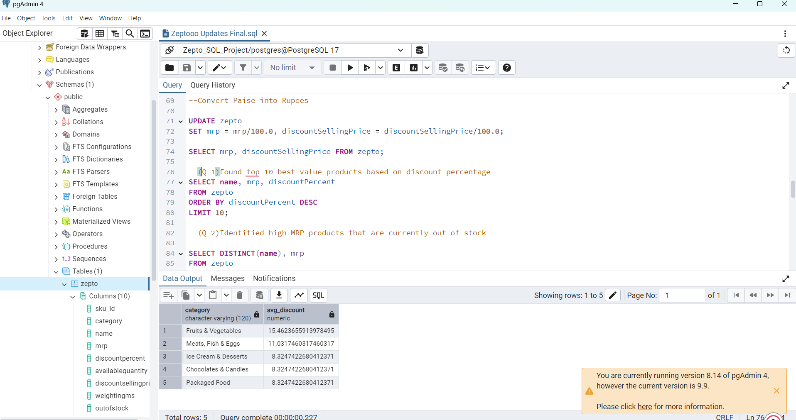
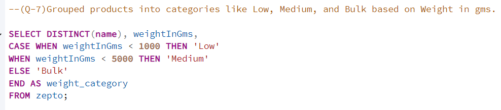

# 🛒 Zepto SQL Data Analysis Project

**Tools Used:** PostgreSQL | pgAdmin4 | SQL | Data Cleaning | Data Analysis

---

## 📘 Project Overview

End-to-end SQL-based analysis using **PostgreSQL** on a Zepto-style online grocery product dataset. The goal was to explore pricing patterns, discount strategy, revenue contribution, and inventory structure across the catalog — using only SQL (joins, aggregations, CASE logic, and grouping) to answer real business questions.

---

## 🎯 Key Objectives

- Perform data exploration and check for missing, duplicate, or invalid values
- Clean the dataset (remove zero-price entries, normalize currency units)
- Derive actionable insights on pricing, discounting, revenue, and inventory weight
- Answer 8 structured business questions using SQL

---

## 🧩 Dataset Information

**File:** `zepto_v2.csv`
**Rows:** 3,732 product entries (after removing 1 invalid zero-MRP row)
**Columns:** Category, Product Name, MRP, Discount %, Available Quantity, Weight (gms), Stock Status, Quantity

---

## 🧮 SQL Workflow & Verified Results

### 1️⃣ Data Exploration
Counted records, checked for nulls/duplicates, reviewed category and stock-status distribution.

### 2️⃣ Data Cleaning
- Removed 1 product with ₹0 MRP
- Converted MRP and discounted selling price from paise to rupees

```sql
UPDATE zepto
SET mrp = mrp / 100.0, discountSellingPrice = discountSellingPrice / 100.0;
```

### 3️⃣ Insights & Analysis

**Q1 — Top 10 products by discount %**
```sql
SELECT name, mrp, discountPercent FROM zepto
ORDER BY discountPercent DESC LIMIT 10;
```
Result: highest discount in the catalog is **51%** (Dukes Waffy Wafers range).

**Q2 — High-MRP products out of stock (MRP > ₹300)**
```sql
SELECT DISTINCT(name), mrp FROM zepto
WHERE outOfStock = TRUE AND mrp > 300
ORDER BY mrp DESC;
```
Result: **8 products**, topped by Patanjali Cow's Ghee (₹565).

**Q3 — Estimated revenue by category**
```sql
SELECT category, SUM(discountSellingPrice * availableQuantity) AS revenue
FROM zepto GROUP BY category ORDER BY revenue DESC;
```
Result: **Cooking Essentials** and **Munchies** are the top revenue-generating categories (₹337,369 each), well ahead of Beverages, which ranks near the bottom.

**Q4 — Expensive products (MRP > ₹500) with minimal discount (<10%)**
```sql
SELECT DISTINCT(name), mrp, discountPercent FROM zepto
WHERE mrp > 500 AND discountPercent < 10
ORDER BY mrp DESC;
```
Result: **82 products** fit this pattern — high-value items with little to no discount incentive.

**Q5 — Top 5 categories by average discount**
```sql
SELECT category, AVG(discountPercent) AS avg_discount
FROM zepto GROUP BY category ORDER BY avg_discount DESC LIMIT 5;
```
Result: **Fruits & Vegetables** has the highest average discount (15.5%), followed by Meats/Fish/Eggs (11%).

**Q6 — Best value per gram (products ≥100g)**
```sql
SELECT DISTINCT(name), weightInGms, discountSellingPrice,
ROUND(discountSellingPrice / weightInGms, 2) AS price_per_gram
FROM zepto WHERE weightInGms >= 100 ORDER BY price_per_gram;
```

**Q7 — Categorize products by weight**
```sql
SELECT DISTINCT(name), weightInGms,
CASE WHEN weightInGms < 1000 THEN 'Low'
     WHEN weightInGms < 5000 THEN 'Medium'
     ELSE 'Bulk' END AS weight_category
FROM zepto;
```
Result: **91% of products (3,392)** fall in the "Low" (<1kg) weight bucket — the catalog is heavily skewed toward small, quick-commerce-friendly items.

**Q8 — Total inventory weight per category**
```sql
SELECT category, SUM(weightInGms * availableQuantity) AS total_weight
FROM zepto GROUP BY category ORDER BY total_weight DESC;
```
Result: **Cooking Essentials** and **Munchies** carry the highest total inventory weight (~1.4M gms each) — relevant for warehouse and logistics prioritization.

---

## 📊 Verified Key Insights

- Highest single-product discount in the catalog: **51%**
- Top revenue categories: **Cooking Essentials & Munchies** (₹337,369 each)
- Highest average-discount category: **Fruits & Vegetables** (15.5%)
- 8 high-MRP products (>₹300) are currently out of stock — led by Patanjali Cow's Ghee
- 82 premium products (MRP > ₹500) carry minimal discount (<10%)
- 91% of the catalog is lightweight (<1kg) — consistent with a quick-commerce grocery model

---

## 🏁 Key Takeaways

- Applied SQL for data cleaning, transformation, and business-question-driven analysis
- Delivered insights on pricing strategy, revenue concentration, and inventory weight distribution
- All 8 queries fully implemented and results independently verified against the raw dataset

---

## 🖼️ Project Snapshots

| Top Discounted Products | Weight Category Query |
|---|---|
|  |  |

---

## 🧠 About the Analyst

**Mohmadadil Shaikh**
Data Analyst | Power BI | SQL | Excel
🔗 [LinkedIn](https://www.linkedin.com/in/mohmadadil-shaikh)
